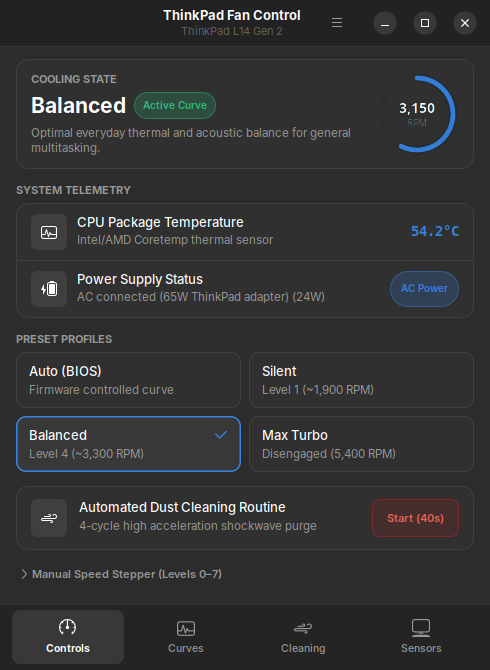
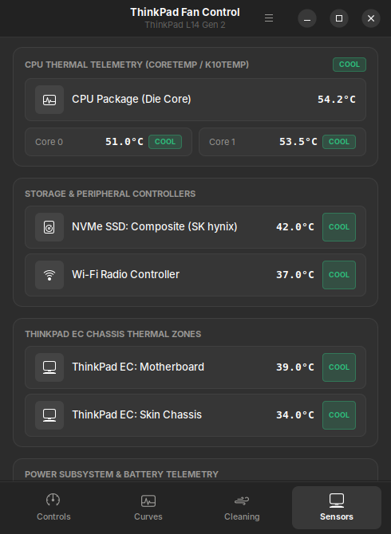
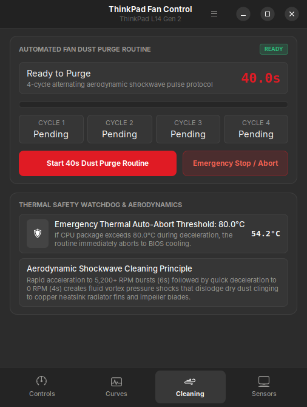
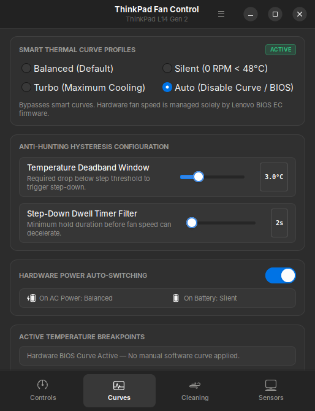

<div align="center">


# ThinkPad Fan Control

**A modern, production-grade fan control suite, telemetry monitor, and dust cleaning utility for Lenovo ThinkPad laptops on Linux.**

[](https://www.python.org/downloads/)
[](https://www.gtk.org/)
[](https://www.thinkwiki.org/wiki/Thinkpad-acpi)
[](https://github.com/s47user/thinkpad-fan-control/releases/tag/v1.2.0)
[](LICENSE)

</div>

---

## Overview

**ThinkPad Fan Control** provides full hardware-level fan control, real-time tachometer speedometer gauges, multi-sensor thermal monitoring, smart curve automation with hysteresis, and an automated aerodynamic fan dust purge routine for Lenovo ThinkPad laptops.

Designed specifically for **Lenovo ThinkPad** hardware running Linux (Ubuntu 24.04 LTS / Debian / Fedora / Arch), directly interfacing with the `thinkpad_acpi` kernel driver and `hwmon` subsystems.

---

## Screenshots

<div align="center">

### Main Dashboard & Real-Time Telemetry


### Multi-Sensor Hardware Thermal Matrix


| Automated Fan Dust Purge Routine | Smart Thermal Curves & Hysteresis |
| :---: | :---: |
|  |  |

</div>

---

## Key Features

### 1. Live RPM Speedometer & 60s Telemetry Graph
* **Visual Speedometer Gauge:** Smooth Cairo-rendered tachometer showing current RPM, percentage of maximum dynamic ceiling, and status.
* **Rolling 60s Telemetry Graph:** Dual-channel live graph plotting CPU temperatures and fan speeds with peak, average, and 85°C fail-safe limit markers.

### 2. Automated Fan Dust Purge Routine (De-Dusting)
* **4-Cycle Pulse Protocol:** A 40-second routine executing 4 rapid acceleration pulses (`disengaged` ~5,200+ RPM burst for 6 seconds) followed by deceleration settle phases (`0 RPM` for 4 seconds).
* **Aerodynamic Shockwave Principle:** Rapid air velocity changes dislodge dry dust clinging to radiator fins and impeller blades.
* **Emergency Auto-Abort:** Safety watchdog auto-aborts the purge and restores maximum cooling if CPU temperature reaches 80.0°C.
* **1-Click Emergency Stop:** Abort anytime to instantly reset fan to BIOS `auto`.

### 3. Smart Fan Curves with Anti-Hunting Hysteresis
* **Profiles:** 
  * `Silent`: Passive cooling bias; keeps fan at 0 RPM below 48°C.
  * `Balanced`: Everyday acoustic and thermal balance (default).
  * `Turbo`: Aggressive cooling for heavy compilation and compute tasks.
  * `Custom`: User-defined temperature breakpoints.
* **Anti-Hunting Hysteresis:** Enforces a **3.0°C deadband** and **5-second dwell filter** on step-down to eliminate annoying fan revving oscillations when hovering around a temperature boundary.

### 4. Multi-Sensor Hardware Thermal Matrix
* Expandable real-time sensor matrix querying:
  * **CPU Package** & individual **Cores** (`coretemp`)
  * **ThinkPad EC Thermal Zones** (Motherboard, ambient zones)
  * **NVMe SSD** Composite & Controller temperatures
  * **Wi-Fi Module** radio temperature
  * **Battery** capacity, status, and charge level

### 5. AC Power vs. Battery Profile Auto-Switching
* Detects hardware AC power transitions:
  * Automatically switches to **Silent / Battery Saver** when unplugged to maximize battery life.
  * Restores **Balanced / Turbo** when plugged into AC power.

### 6. Desktop Notifications with Debouncing
* Native desktop notifications (`libnotify` / `notify-send`) for:
  * High CPU temperature warnings (>82.0°C)
  * Fail-safe watchdog trips (>85.0°C)
  * Power profile transitions (AC vs Battery)
  * Dust purge completion summary
* Built-in 60-second rate-limiting cooldown prevents notification spam.

### 7. Top Panel Tray Indicator (Ayatana AppIndicator)
* Persistent top bar indicator displaying live telemetry (`52°C | 2,800 RPM [auto]`).
* Quick menu for switching presets, launching Dust Purge, or configuring curves without opening the main window.

### 8. Native Polkit & Persistent Boot Permissions
* Includes systemd tmpfiles configuration (`setup/thinkpad-fan.tmpfiles.conf`) so `/proc/acpi/ibm/fan` remains writable across system reboots.
* Polkit policy (`setup/org.thinkpad.fancontrol.policy`) for graphical authentication.

---

## Installation & Setup

### Prerequisites

Ensure `thinkpad_acpi` is loaded with fan control enabled.

1. **Install dependencies (Ubuntu / Debian):**
   ```bash
   sudo apt update
   sudo apt install -y python3-gi python3-gi-cairo gir1.2-gtk-3.0 gir1.2-ayatanaappindicator3-0.1 libnotify-bin
   ```

2. **Run One-Time Permissions Setup:**
   ```bash
   chmod +x setup_permissions.sh
   ./setup_permissions.sh
   ```
   This configures:
   * Kernel module parameter `options thinkpad_acpi fan_control=1`
   * Persistent systemd tmpfiles rule (`/etc/tmpfiles.d/thinkpad-fan.conf`)
   * Polkit elevation policy (`/usr/share/polkit-1/actions/org.thinkpad.fancontrol.policy`)

---

## Running the Application

### From Terminal:
```bash
python3 main.py
```

### Desktop Launcher:
Install the `.desktop` shortcut into your user applications:
```bash
cp thinkpad-fan-control.desktop ~/.local/share/applications/
update-desktop-database ~/.local/share/applications/
```
The application will now appear in your application grid and dock as **ThinkPad Fan Control**.

---

## Running Tests

Run the automated test suite covering curve hysteresis, power transitions, and sensor telemetry:
```bash
python3 -m unittest discover -s tests -v
```

---

## Compatibility

Tested and optimized for:
* **Lenovo ThinkPad L14 Gen 2 (Intel)**
* **ThinkPad T-Series:** T480, T490, T14 Gen 1/2/3/4
* **ThinkPad X-Series:** X1 Carbon Gen 6–11, X13, X280
* **ThinkPad P-Series:** P14s, P15s, P1, P52/P53
* Any ThinkPad laptop supported by the Linux `thinkpad_acpi` driver.

---

## License

This project is licensed under the [MIT License](LICENSE).
